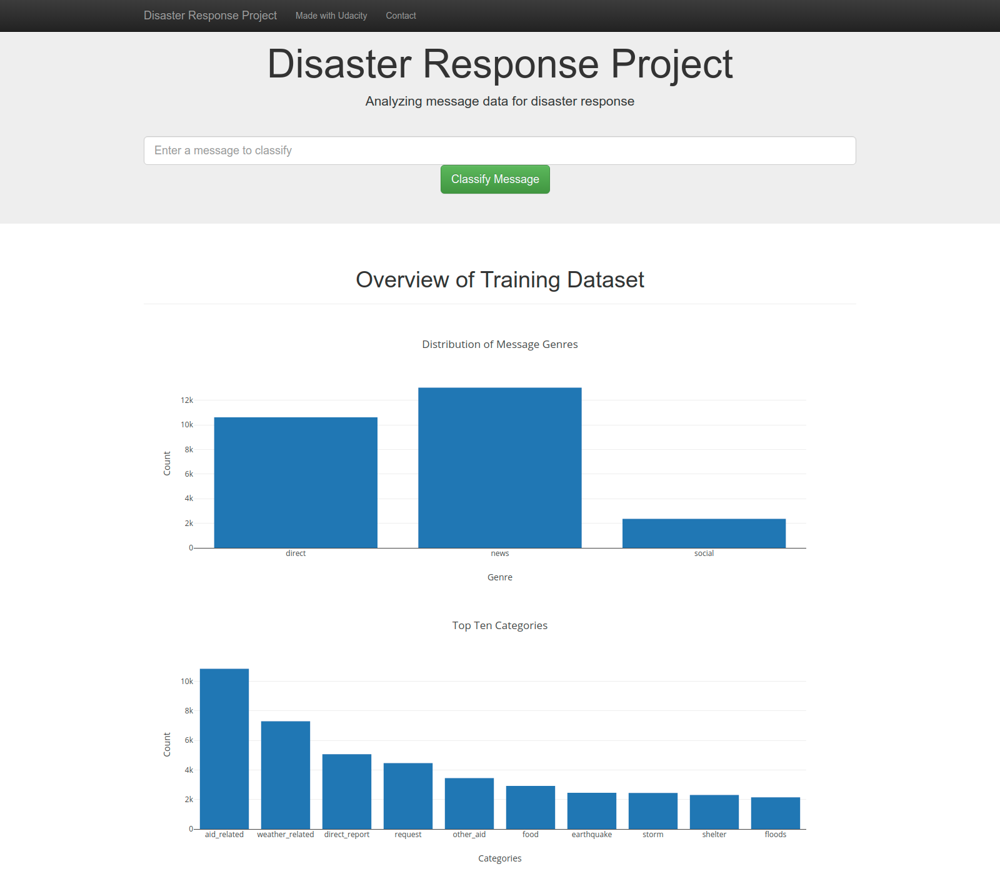
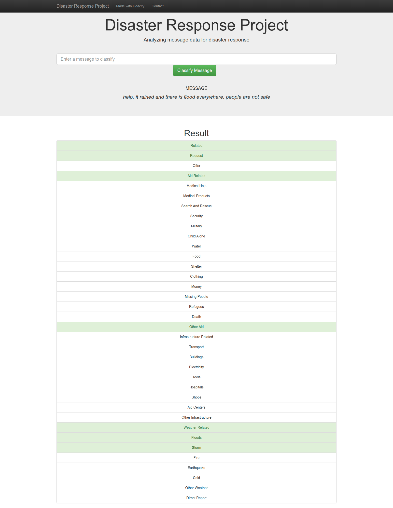

# Disaster Response Pipeline Project
### Installation
This repository was written in HTML and Python , and requires the following Python packages: pandas, numpy, re, pickle, nltk, flask, json, plotly, sklearn, sqlalchemy, sys, warnings.

### Project Motivation
In this project, I appled data engineering, natural language processing, and machine learning skills to analyze message data that people sent during disasters to build a model for an API that classifies disaster messages. These messages could potentially be sent to appropriate disaster relief agencies.

### File Descriptions:
process_data.py: A ETL Pipeline that

* loads the messages and categories datasets
* merges the two datasets
* cleans the data
* stores it in a SQLite database
train_classifier.py: A Machine Learning Pipeline that

* loads data from the SQLite database
* splits the dataset into training and test sets
* builds a text processing and machine learning pipeline
* trains and tunes a model using GridSearchCV
* outputs results on the test set
* exports the final model as a pickle file
run.py: A Flask Web App that visualizes the results

### Instructions:
1. Run the following commands in the project's root directory to set up your database and model.

    - To run ETL pipeline that cleans data and stores in database
        `python data/process_data.py data/disaster_messages.csv data/disaster_categories.csv data/DisasterResponse.db`
    - To run ML pipeline that trains classifier and saves
        `python models/train_classifier.py data/DisasterResponse.db models/classifier.pkl`

2. Run the following command in the app's directory to run your web app.
    `python run.py`

3. Go to http://0.0.0.0:3001/

## Screenshots

### Licensing, Authors, Acknowledgements
This app was completed as part of the Udacity Data Scientist Nanodegree. Code templates and data were provided by Udacity. The data was originally sourced by Udacity from Figure Eight.

